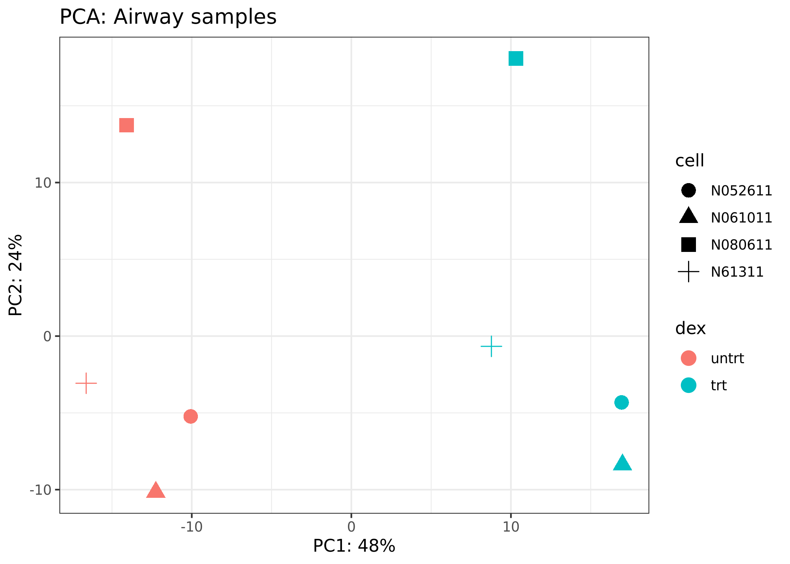
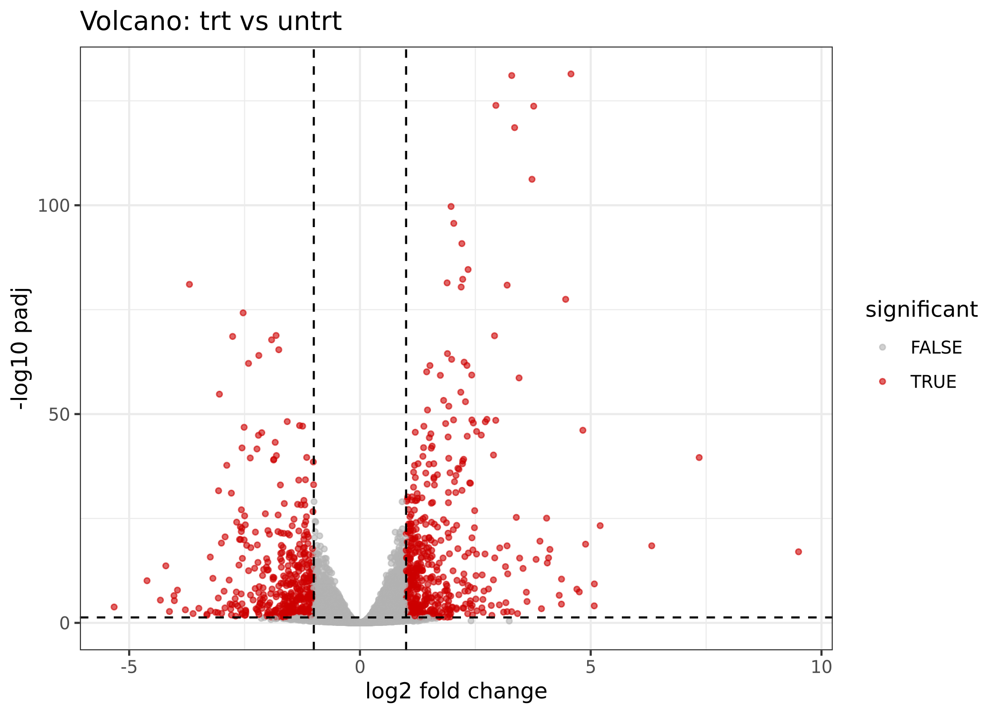
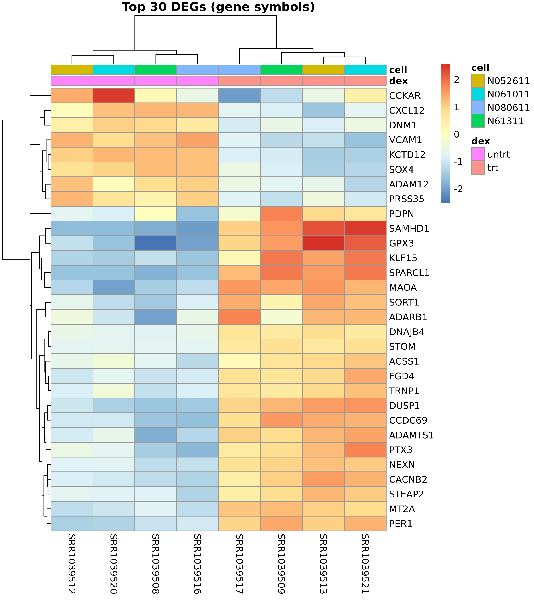

# Airway RNA-seq Differential Expression Analysis

Bulk RNA-seq differential expression analysis comparing dexamethasone-treated
vs untreated human airway smooth muscle cells, using DESeq2.

## Dataset

`airway` Bioconductor package (Himes et al. 2014, PMID: 24926665).

- 8 samples from 4 human airway smooth muscle cell lines (N052611, N061011, N080611, N61311)
- Each line measured under 2 conditions: untreated (`untrt`) vs dexamethasone-treated (`trt`)
- Paired-end RNA-seq, gene-level counts from a SummarizedExperiment object

## Methods

- **Pre-filtering**: keep genes with ≥10 reads in ≥3 samples (63,677 → 16,596 genes)
- **Design formula**: `~ cell + dex` (cell line modeled as batch covariate)
- **Differential expression**: DESeq2 v1.46 with Wald test, contrast `trt vs untrt`
- **Significance threshold**: adjusted p-value (BH) < 0.05
- **Visualization**: VST-normalized counts for PCA and heatmap, raw log2FC for volcano

## Results

| Metric | Value |
|---|---|
| Total genes tested | 16,596 |
| Significant DEGs (padj < 0.05) | 4,099 |
| Upregulated (log2FC > 0) | 2,201 |
| Downregulated (log2FC < 0) | 1,898 |

### PCA

PC1 (48% variance) cleanly separates treatment conditions. PC2 (24%) reflects
cell-line variation, which is controlled for in the design formula.



### Volcano plot

Symmetric distribution of DEGs with strong statistical signal. Top hits show
-log10(padj) > 100, consistent with known glucocorticoid response genes.



### Heatmap (top 30 DEGs)

Top 30 most significant DEGs achieve complete separation of treated vs
untreated samples by hierarchical clustering, including known DEX-responsive
genes (PER1, MT2A, SPARCL1).



## Reproducibility

From the repository root:

```bash
# 1. Create the conda environment
conda env create -f ../../environment.yml
conda activate bioagent-r

# 2. Run the analysis
cd projects/01-airway-deseq2
Rscript scripts/01_deseq2_analysis.R
```

Runtime: ~2 minutes on a standard laptop.

## Outputs

```
results/
├── figures/
│   ├── 01_pca.png
│   ├── 02_volcano.png
│   └── 03_heatmap_top30.png
└── tables/
    └── DEGs_padj0.05.csv
```

## Citation

Himes BE et al. *RNA-Seq Transcriptome Profiling Identifies CRISPLD2 as a
Glucocorticoid Responsive Gene that Modulates Cytokine Function in Airway
Smooth Muscle Cells.* PLoS One. 2014;9(6):e99625.
