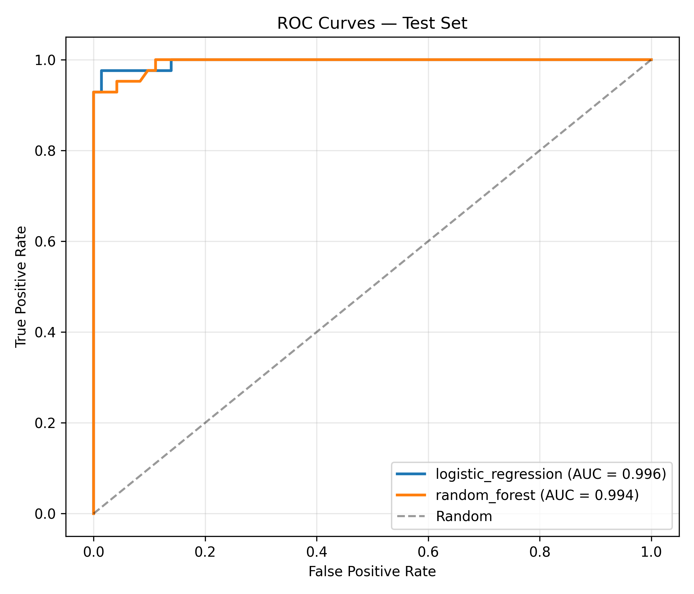
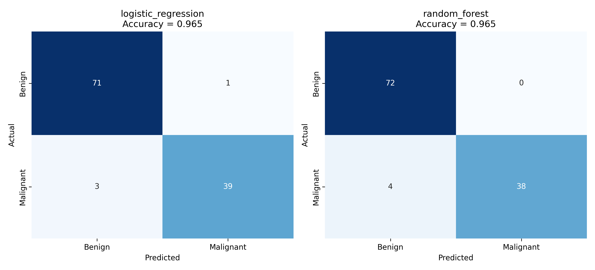
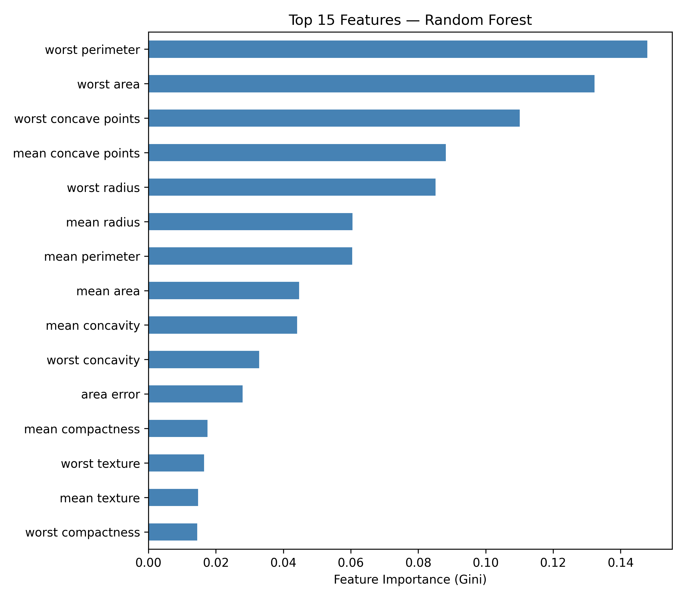



## Figures

### ROC Curves

Both models achieve AUC > 0.99 on the holdout test set. Logistic Regression
(blue) maintains a slightly higher true positive rate at low false positive rates,
consistent with its superior recall for the malignant class.



### Confusion Matrices

Identical accuracy (96.5%) but different error profiles: Logistic Regression
produces 3 false negatives and 1 false positive; Random Forest produces 4 false
negatives and 0 false positives. In screening contexts, the lower false negative
count of Logistic Regression is clinically preferable.



### Feature Importance (Random Forest)

Worst-case nucleus measurements dominate. The top 3 features — worst perimeter,
worst area, and worst concave points — account for approximately 39% of total
Gini impurity reduction, reflecting the known pathological pattern of larger,
more irregular nuclei in malignant tumors.



## Performance Summary

| Model | CV AUC (mean ± SD) | Test AUC | Accuracy | Recall | FN |
|---|---|---|---|---|---|
| **Logistic Regression** | **0.9958 ± 0.0047** | **0.9960** | 96.5% | **0.929** | **3** |
| Random Forest | 0.9889 ± 0.0070 | 0.9942 | 96.5% | 0.905 | 4 |

*FN = false negatives (missed malignancies) on 114-sample holdout test set.*
*CV = stratified 5-fold cross-validation on 455-sample training set.*

## Reproducibility

```bash
conda activate bioagent-r
python projects/02-breast-cancer-ml/scripts/01_train_classifier.py
python agents/ml_results_agent.py
quarto render projects/02-breast-cancer-ml/report/report.qmd
```

## Reference

Street WN, Wolberg WH, Mangasarian OL. *Nuclear feature extraction for breast
tumor diagnosis.* IS&T/SPIE Int Symp Electronic Imaging. 1993;1905:861-870.
